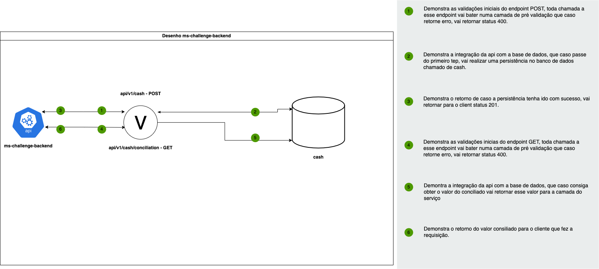

# ms-challenge-backend



## Sobre

Microserviço relacionado a um desafio técnico da empresa Opah IT, que possui dois endpints, um POST para cadastro de
DEBITOS E CREDITOS, e um GET para retornar o conciliado de algum dia específico ou do dia atual.

## Ferramentas

- Java 17
- Maven
- Spring Boot(JPA,WEB)
- Flyway
- Swagger

## Ambiente Local

**Executar via docker**

- Ter o docker e docker-compose instalado
- A partir da raiz do projeto executar o seguinte comando:

```
docker-compose up -d
```

- Esse comando vai subir um mysql localmente e também vai subir o projeto, nas portas 3306(mysql) e 8080(api)

**Executar via terminal**

- Ter o Java 17 instalado
- Ter o maven configurado
- Ter um banco mysql rodando local
- Vai ser necessario executar os seguintes comandos:

```
mvn clean install
```

```
java -DMS_CHALLENGE_BACKEND_DB_USER=your_user -DMS_CHALLENGE_BACKEND_DB_PASSWORD=your_password -DMS_CHALLENGE_BACKEND_DB_URL=your_url -jar target/ms-challenge-backend-0.0.1-SNAPSHOT.jar
```

## Serviços

**/api/v1/cash - POST**

- É um serviço que permite o cadastro de um débito ou crédito, que contém alguns parâmetros obrigatórios na requisição:

clientName = Parametro obrigatório se trata nome do estabelecimento ou pessoa que recebeu o pagamento ou pagou

type = Parametro obrigatório se trata da opção se é um DÉBITO ou CRÉDITO

value = Parametro obrigatório se trata do valor a ser debitado ou creditado dependendo do tipo.

date = Parametro opcional se trata da data que foi feito o debito ou credito (caso não passado entende-se que se trata
da data atual), formato: yyyy-MM-dd HH:mm:ss

**/api/v1/cash/conciliation - GET**

- É um serviço que retorna o concolidado de um dia específico ou do dia atual do estabelecimento,
  possui um unico parametro opcional.

date = parametro opcional que se trata da data a ser concolidada, caso não passada entende-se que é do dia atual,
formato : yyyy-MM-dd.

## Recursos

- [API -Swagger](http://localhost:8080/swagger-ui.html)

